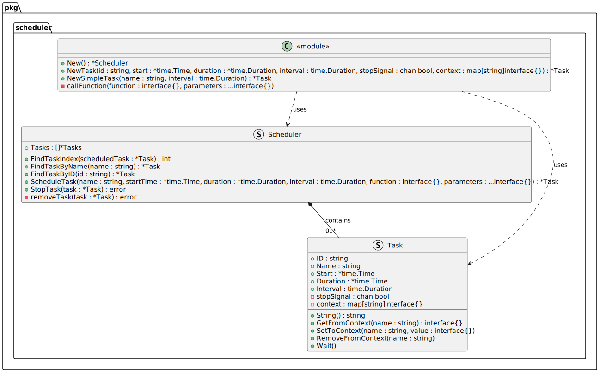

# Go Scheduler

[](https://pkg.go.dev/github.com/dl1998/go-scheduler)

Minimalistic scheduler library for GoLang.


## Installation

```bash
go get github.com/dl1998/go-scheduler
```

or

```bash
go install github.com/dl1998/go-scheduler@v1.0.0
```

## Usage

Check examples provided in the [examples](./examples).

For scheduling a new task:

```go
taskName := "Task Name"
taskStartTime := nil // To schedule immediately.
taskDuration := 10 * time.Second // How long it will be active (10 seconds).
taskInterval := time.Second // Periodicity with which function will be executed (every second).
taskFunction := function(task *Task, name: string) {
	fmt.Printf("Hello, %s!\n", name)
}

newScheduler := scheduler.New()

newTask := newScheduler.ScheduleTask(taskName, taskStartTime, taskDuration, taskInterval, taskFunction, "world")
```

By default program will be interrupted if there is no other code to be performed. In order to wait until task will be completed use:

```go
newTask.Wait()
```

It will block program execution and wait until task will be completed. Alternatively you could use sleep:

```go
time.Sleep(taskDuration)
```

However, if you want to interrupt task before it has been finished, you could do it manually using:

```go

newScheduler.StopTask(newTask)
```

## Class Diagram

